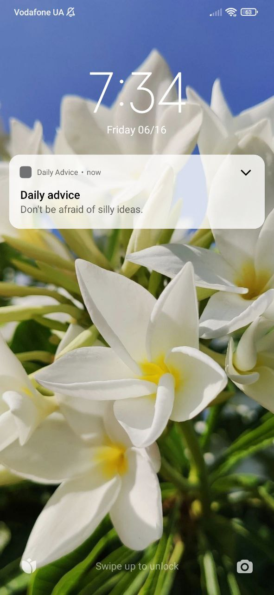
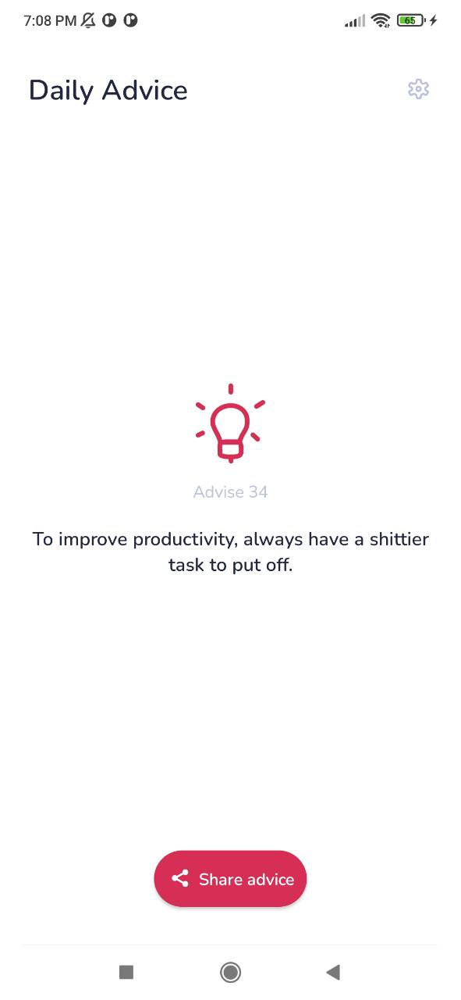
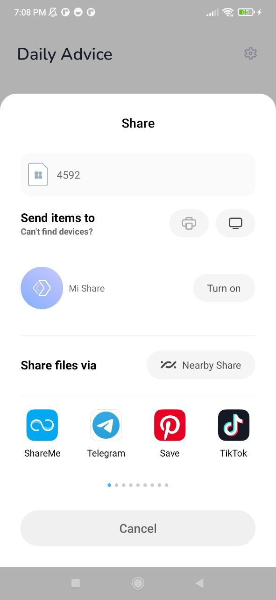
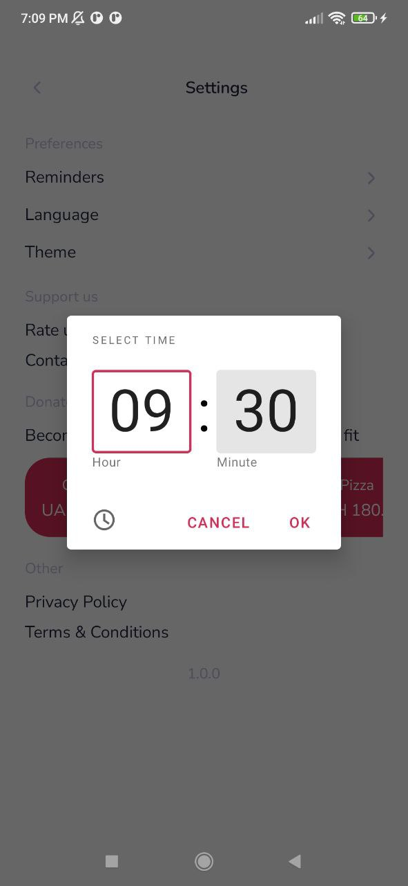
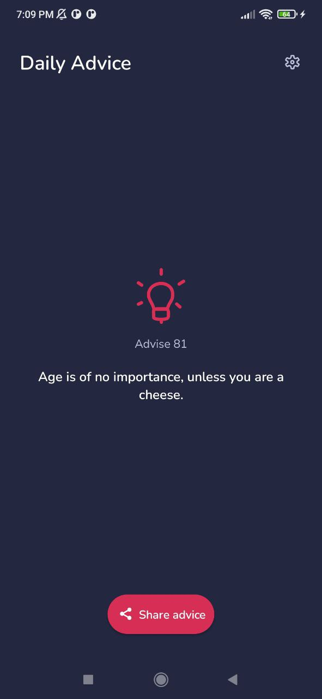

# 💡 Daily Advice

**Daily Advice** is daily dose of inspiration with customizable reminders and notifications

> Get inspired, motivated every day with our Daily Advice app

Is also part of my portfolio projects :) It showcases my skills regarding developing Android apps.

## 🚀Currently available on the Play store

<a href="https://play.google.com/store/apps/details?id=com.bejussi.dailyadvice"></a>

## 📸 Screenshots

  
  


## 🔥 Features

* Inspirational quotes
* Reminders and notifications
* Advice sharing
* Light/Dark themes
* Support for multiple languages

## 🔧 Built With

* Kotlin
* MVVM
* Retrofit
* GSON
* Room
* Coroutines
* WorkManager
* AlarmManager
* BroadcastReceiver
* Preferences DataStore
* Navigation Component
* View Banding
* Dagger Hilt
* SwipeRefreshLayout
* SplashScreenApi

## ⚡ Getting Started

These instructions will get you a copy of the project up and running on your local machine

### Prerequisites

What things you need to have to build this project.

* Android Studio

### Installing

A step by step to get working project

``` 
1. Clone this repository or download file
2. Extract zip if downloaded code
3. Open project in Android Studio
4. Wait while Android Studio Download gradle or required files
5. Hit Run Button ! 
```

## ✨ Contributing

You can star ⭐ and fork 🍽️ this repository on GitHub by navigating at the top of this repository

## 📝 License

This project is licensed under the MIT License - see the [LICENSE](LICENSE) file for details
